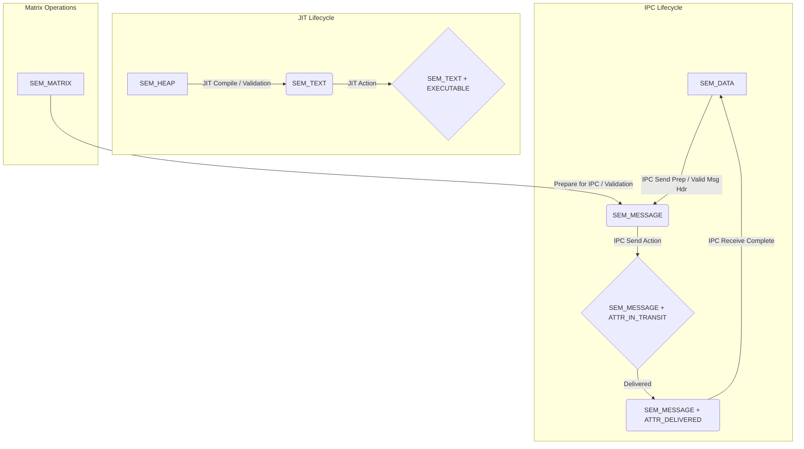

# Semantic State Machine (SSM)

## Overview

The Semantic State Machine governs the transitions of memory regions between different semantic domains. Each transition is subject to rules, attribute checks, and validation routines to ensure system stability and coherence. This document outlines the valid states, transitions, and interactions with other kernel subsystems.

## Semantic Domains

The following primary semantic domains are defined:

*   **`SEM_NONE`**: An uninitialized or undefined state.
*   **`SEM_DATA`**: General-purpose readable/writable data. May have attributes like `SEM_ATTR_WRITABLE`, `SEM_ATTR_BUFFER_VALID`.
*   **`SEM_TEXT`**: Executable code. Typically has attributes `SEM_ATTR_EXECUTABLE` and `SEM_ATTR_IMMUTABLE` (or is at least read-only after creation).
*   **`SEM_STACK`**: Process or kernel stack. Readable/writable, non-executable.
*   **`SEM_MESSAGE`**: Data region actively being used as an IPC message. Attributes like `SEM_ATTR_IN_TRANSIT`, `SEM_ATTR_DELIVERED` track its lifecycle.
*   **`SEM_MATRIX`**: Memory region optimized or designated for matrix operations.
*   **`SEM_HEAP`**: Dynamically allocated memory, typically writable and non-executable initially.

## Key Attributes Affecting Transitions

*   `SEM_ATTR_WRITABLE`: Region can be written to.
*   `SEM_ATTR_EXECUTABLE`: Region can be executed.
*   `SEM_ATTR_IMMUTABLE`: Region content should not change (stronger than read-only).
*   `SEM_ATTR_COMPUTING`: A computation (e.g., matrix operation) is in progress.
*   `SEM_ATTR_EXECUTING`: Code in this region is currently being executed.
*   `SEM_ATTR_IN_TRANSIT`: An IPC message is currently being sent/processed.
*   `SEM_ATTR_DELIVERED`: An IPC message has been successfully delivered.
*   `SEM_ATTR_COMPILED`: A region (e.g., from `SEM_HEAP`) has been successfully JIT-compiled.
*   `SEM_ATTR_BUFFER_VALID`: Data in a buffer (e.g., after IPC receive) is valid for use.

## State Transition Diagram (Mermaid Syntax)



## Valid Transitions and Rules

The `vm_semantic_transition(struct coherence_state *coh, enum semantic_domain new_domain, struct proc *p)` function manages all transitions. The following transitions are currently defined:

1.  **`SEM_DATA` -> `SEM_MESSAGE`**
    *   **Purpose**: Preparing a data buffer to be sent as an IPC message.
    *   **Required Attributes (on `SEM_DATA` state)**: None explicitly by default, but could include `SEM_ATTR_BUFFER_VALID`.
    *   **Forbidden Attributes (on `SEM_DATA` state)**: `SEM_ATTR_EXECUTING`, `SEM_ATTR_COMPUTING`.
    *   **Validator (`validate_data_to_message`)**:
        *   Checks for a valid message header (e.g., magic number, consistent size) within the region.
        *   If distributed, may check vector clock initialization.
    *   **Action (`action_data_to_message`)**:
        *   Sets `SEM_ATTR_IN_TRANSIT`.
        *   Clears `SEM_ATTR_BUFFER_VALID` (if it was used to mark readiness).
        *   If distributed, may increment vector clock.

2.  **`SEM_MESSAGE` -> `SEM_DATA`**
    *   **Purpose**: Converting a received IPC message buffer back to a general data region.
    *   **Required Attributes (on `SEM_MESSAGE` state)**: `SEM_ATTR_DELIVERED`.
    *   **Forbidden Attributes (on `SEM_MESSAGE` state)**: `SEM_ATTR_IN_TRANSIT`.
    *   **Validator (`validate_message_to_data`)**:
        *   May perform final integrity checks on the message.
    *   **Action (`action_message_to_data`)**:
        *   Clears `SEM_ATTR_IN_TRANSIT` and `SEM_ATTR_DELIVERED`.
        *   Sets `SEM_ATTR_BUFFER_VALID` to indicate data is ready for consumption.

3.  **`SEM_HEAP` -> `SEM_TEXT`**
    *   **Purpose**: Transitioning a JIT-compiled region from heap memory to executable text.
    *   **Required Attributes (on `SEM_HEAP` state)**: `SEM_ATTR_COMPILED`.
    *   **Forbidden Attributes (on `SEM_HEAP` state)**: `SEM_ATTR_WRITABLE` (The FSM rule for target `SEM_TEXT` usually implies it won't be writable. The validator ensures current state is safe).
    *   **Validator (`validate_heap_to_text`)**:
        *   Ensures the memory region is readable for final validation.
        *   Performs code safety checks (stubs for detailed disassembly/analysis).
        *   Verifies no active writers to the region (`coh->cs_active_writers == 0`).
        *   Checks for proper instruction alignment.
        *   If distributed, may perform a consensus check.
    *   **Action (`action_heap_to_text`)**:
        *   Updates page protections (e.g., via `pmap_protect`) to Read+Execute.
        *   Sets `SEM_ATTR_EXECUTABLE`.
        *   Clears `SEM_ATTR_WRITABLE`.

4.  **`SEM_MATRIX` -> `SEM_MESSAGE`**
    *   **Purpose**: Preparing matrix data for IPC transmission.
    *   **Required Attributes (on `SEM_MATRIX` state)**: None explicitly by default.
    *   **Forbidden Attributes (on `SEM_MATRIX` state)**: `SEM_ATTR_COMPUTING`.
    *   **Validator (`validate_matrix_to_message`)**:
        *   Ensures matrix data is in a serializable/transmittable format.
    *   **Action (`action_matrix_to_message`)**:
        *   Sets `SEM_ATTR_IN_TRANSIT`.
        *   May perform serialization or prepare metadata for transmission.

## Interactions with Kernel Subsystems

### 1. IPC (Inter-Process Communication) - `kern_ipc_zerocopy.c`

*   **Channel Creation (`create_zero_copy_channel`)**:
    *   When a zero-copy IPC channel is created, its underlying buffer is associated with a `coherence_state`.
    *   This `coherence_state`'s `cs_semantic` descriptor is initialized to `SEM_DATA` with attributes like `SEM_ATTR_WRITABLE`.
    *   The memory range is then registered with the global semantic registry via `vm_semantic_register()`.
*   **Sending Data (`zero_copy_send`)**:
    *   Before data is written to the shared buffer for sending, `vm_semantic_transition()` is called to change the buffer's state from `SEM_DATA` to `SEM_MESSAGE`.
    *   This transition involves validation (e.g., checking message headers) and actions (e.g., setting `SEM_ATTR_IN_TRANSIT`).
*   **Receiving Data (Conceptual)**:
    *   After a receiver has processed a message, a subsequent call (e.g., `zero_copy_receive_complete()`, not yet fully implemented) would trigger `vm_semantic_transition()` to change the state from `SEM_MESSAGE` (with `SEM_ATTR_DELIVERED`) back to `SEM_DATA` (with `SEM_ATTR_BUFFER_VALID`).

### 2. JIT Compilation (Conceptual)

*   A JIT compiler would allocate memory (likely `SEM_HEAP` or `SEM_DATA`).
*   After generating code, it would mark the region with `SEM_ATTR_COMPILED`.
*   It would then request a transition via `vm_semantic_transition()` to `SEM_TEXT`.
*   The SSM validator (`validate_heap_to_text`) would perform safety checks.
*   The SSM action (`action_heap_to_text`) would change memory protections to Read+Execute and update attributes.

### 3. Signal Delivery - `kern_sig_unified.c`

*   The `semantic_sendsig()` (or a future enhanced version) should consult the semantic domain of the target memory region (if the signal is memory-context specific, e.g., a precise fault on an execution within a `SEM_TEXT` region).
*   Delivering a signal might be disallowed or modified if a region is in a sensitive transitional state (e.g., `SEM_ATTR_IN_TRANSIT` and the signal could corrupt it, or if a region is currently being JITted and not yet `SEM_TEXT`).
*   The signal frame (`semantic_signal_frame`) itself might be placed on a stack (`SEM_STACK`), and its setup must respect stack semantics.
*   If a signal is meant to interrupt an operation within a specific semantic domain (e.g., aborting a matrix computation in `SEM_MATRIX`), the signal handler might trigger a semantic state transition (e.g., `SEM_MATRIX` with `SEM_ATTR_COMPUTING` to `SEM_MATRIX` without that attribute).

### 4. Memory Coherence - `vm_coherence.c`

*   The `coherence_state` structure (`struct coherence_state`) is the authoritative source for a region's current `semantic_descriptor` (`cs_semantic`).
*   All calls to `vm_semantic_transition()` require a pointer to the `coherence_state` of the memory region.
*   The SSM updates `cs_semantic.domain`, `cs_semantic.attributes`, `cs_semantic.transition_count`, and `cs_write_generation` within the `coherence_state` under its lock (`cs_lock`).
*   **Write Protection (`vm_coherence_mark_write`)**: This function (called when a write to a coherent region is about to occur) checks `coh->cs_semantic.domain` and `coh->cs_semantic.attributes`. If the domain is `SEM_TEXT` or has `SEM_ATTR_IMMUTABLE`, it indicates a potential error or an unhandled state (as the FSM should prevent writes to such regions via pmap changes during transitions). This acts as a safety net.
*   **Notifications**:
    *   `notify_transition_all_levels()`: Called by the SSM after a successful transition. It iterates through `coh->cs_mappings` (virtualization levels) and calls `update_level_protection()` to adjust memory protection flags (e.g., pmap entries) according to the new semantic domain.
    *   `propagate_transition_network()`: If `coh->cs_distributed` is true, the SSM calls this to inform other nodes in a distributed system about the semantic change, using vector clocks for ordering if necessary.

## Future Considerations

*   Hierarchical semantic domains.
*   More granular attributes and transition rules.
*   Distributed consensus for semantic transitions in a multi-node setup.
*   Integration with dynamic code loading/unloading and its impact on `SEM_TEXT` regions.

This document provides a snapshot of the SSM's design and its intended interactions. It will evolve as the kernel development progresses.
```
